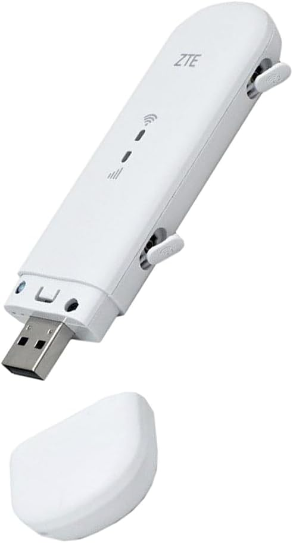
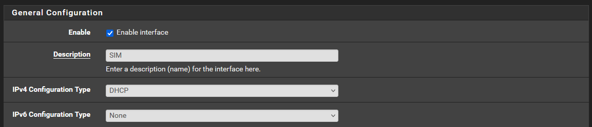
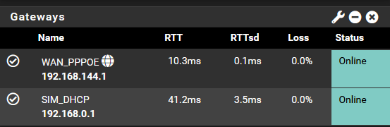
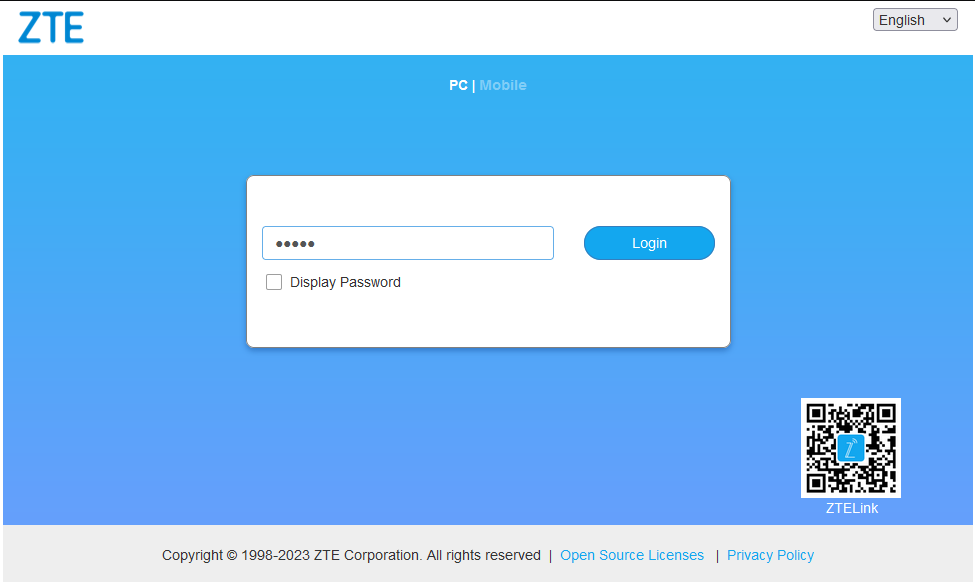
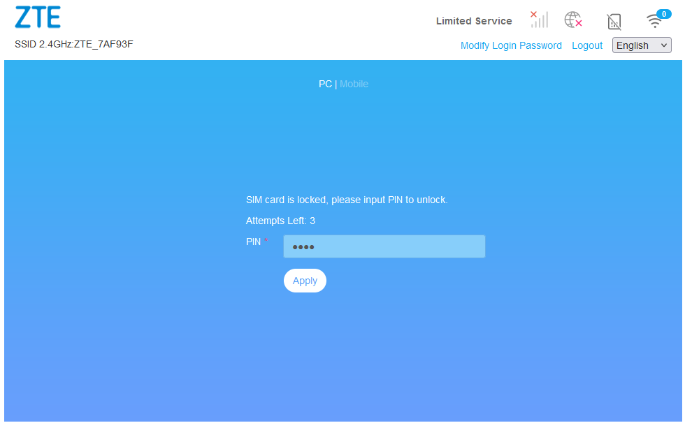
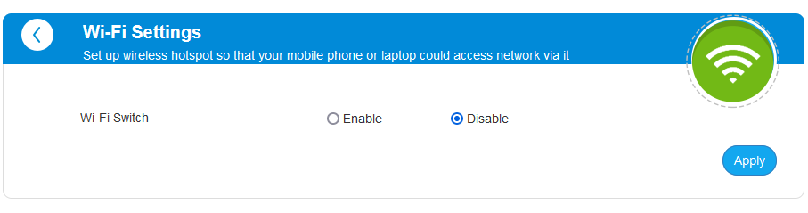

[ZTEMF79N]: https://www.amazon.es/dp/B08WPXRTRL 
[pfsense-compatible-modems]: https://docs.netgate.com/pfsense/en/latest/cellular/hardware.html
[pfsense-download]: https://www.pfsense.org/download/

# Añadir una SIM como *failover* para tu red
## Introducción
Si tenemos una red donde el acceso a internet es de vital importancia nos puede interesar tener conexiones de respaldo, de manera que si la principal falla la directamente mejor tome el relevo. Es importante utilizar distintas tecnologías de respaldo, pues estas normalmente no comparten infrastructura. Por ejemplo, en España, en las ciudades es común tener despliegue de fibra optica, coaxial i sistemas de telefonía movil. También podemos incluir el internet satelital como opción. Dependiendo de la empresa y sus posibilidades economicas le conviene barajar distintas opciones. 

Una opción bastante *cost-effective*, y la que yo he escogido, es añadir una conexión a la red telefonica mediante una SIM. Se puede añadir al contrato que ya se tiene para la fibra y aprovechar ofertas o promociones. Esto tiene varios inconvenientes y uno de ellos es que si se cae el internet en una zona todos los dispositivos moviles que utilizaban el Wi-Fi de su hogar pasan a utilizar la red movil, lo que puede afectar al ancho de banda justo cuando más la necesitas. Si el internet es necesario, pero el uso es bajo es más que suficiente para salir del paso sin dejarse una fortuna. 

## Requerido
Normalmente no se puede añadir a un router de compañía una tarjeta SIM como backup a menos que el router sea directamente un router 5G o 4G. Para poder aprovechar distintas conexiones a internet lo mejor es un router neutro. En mi caso utilizo pfSense, no porque sepa que es el mejor o haya probado muchos, sino porque cuando empecé a trastear fue el primero que utilice debido a tener una licencia gratuita. En definitiva, como ingredientes necesitamos:

- Un router neutro, normalmente todos permiten lo que vamos a hacer, la guía estará enfocada en pfSense, lo puedes descargar de [la página oficial][pfsense-download]
- Un adaptador de SIM, yo utilizo un [ZTE MF79N][ZTEMF79N], puedes ver un listado en [la web oficial de Netgate][pfsense-compatible-modems], la empresa que gestiona pfSense.
- Una tarjeta SIM, deberás tener acceso al PIN.

## Tutorial
### Preparar la SIM
Te tendrás que leer las instrucciones de tu adaptador, pero en el mio es tan sencillo como deslizar uno de los lados que hace de tapa. Insertas la SIM y lo conectas por USB a tu router.

### Configuración del router
#### Configuración Interfaz
Dependiendo de como se comporte tu adaptador tendrás que configurarlo de manera distinta. Puede que se comporte como una conexión de red o como un modem. En mi caso se comporta como un dispositivo ethernet, por lo que tenemos que crear una nueva interfaz y configurarla. 

#### Configuración failover

Una vez configurada la interfaz podemos añadirla como failover. Desde System > Routing podemos crear un gateway group, de manera que si la primera conexión falla, la fibra, tires de la sim. 

Una vez creado el grupo de gateways, podemos indicar que el grupo es la salida predeterminada, de manera que se encargue solo en caso de fallo de la red principal. Ahora podemos ver el monitoreo de las dos interfaces, viendo como ambas estan activas. 

### Configuración Adaptador
#### Acceso web
El adaptador tiene un servicio de DHCP con lo que asignará la IP dinámicamente al router. Una vez configurado podemos ir al panel web del adaptador y identificarnos con los credenciales por defecto. 

Una vez dentro introducimos el PIN de la tarjeta SIM.

En la barra superior deberíamos ver que la conexión se ha establecido, la calidad de la conexión. Lo bueno de este adaptador es que permite antenas externas, con lo que si la señal es mala se puede hacer algo al respecto. 

#### Deshabilitar Wifi

Podemos aprovechar para deshabilitar el acceso wifi, pues la conexión será a través del router. A parte podemos configurar servicios como DDNS o un firewall sencillo, pero es mejor hacer todo esto a través del router. 

## Probando el funcionamiento
Recordar que ahora tenemos dos IPs, por lo que la transición no será necesariamente suave. Para las aplicaciones habrá un cambio abrupto de la IP pública, lo que se puede gestionar bien o mal. En el peor de los casos será necesario refrescar la aplicación o cerrar y abrir. 

Probamos que funciona desconectando virtualmente, no hay necesidad de tocar nada, la conexión principal. Y miramos las interfaces que hay funcionando y de navegar por internet. 

Estamos funcionando 🎉. Ya tenemos un failover asequible que se puede implementar en cualquier empresa sin mucho trabajo. 