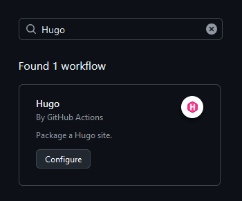
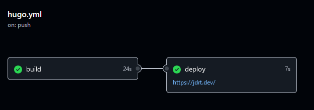
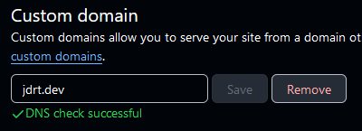
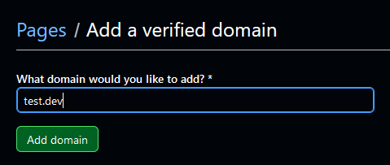
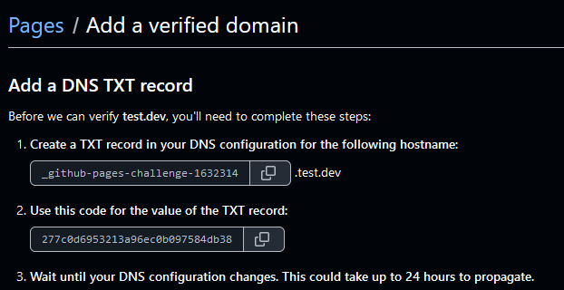

# Utilizar *GitHub Pages* para hostear tu propia web
## Introducción
Siempre he querido tener una página web sencillita donde ir posteando **fácilmente** (enfasis en esto) artículos. Hoy en día es más fácil que antaño, pero se deben tener en cuenta muchas cosas que no són evidentes como certificados SSL, dominio o hosting. Por suerte tenemos una forma de no tener que lidiar con ello a través de GitHub. Para ello utilizaremos un renderizador de páginas web estáticas, en mi caso es Hugo, pero se pueden utilizar otros sin problema. También se puede añadir el paso opcional de utilizar un dominio propio, la única parte que cuesta dinero, pero al cabo del año no es nada.

Para hacer un adelanto de lo que será. El workflow será el siguiente. Tendremos un repositorio que contendrá nuestras páginas web. En este repositorio subiremos y modificaremos los *posts* o páginas que querramos. Una vez subido a GitHub, a través	de GitHub Actions, se ejecutará un *script* para renderizar y subir nuestra página web a GitHub Pages, de manera completamente automática. Hay muchas tecnologías implicadas, pero el resultado final es algo muy cómodo (solo si eres programador😅). Para personas que nunca han programado esto debe ser complicado y poco intuitivo. 

## Repositorio de GitHub
### Creación
Primerisimo, tener una cuenta de GitHub, pero si estas aquí seguramente ya tengas una. Si no es así aprovecha para crearte una, es gratis 😉. Ahora solo debemos crear un repositorio de GitHub. Podemos hacerlo a través de nuestro IDE favorito o a través de la página web. 

A la hora de crear el repositorio es conveniente ponerle el nombre de `<tu nombre de usuario>.github.io`. De esta manera el enlace a la web será más corto, es solo un detalle no es obligatorio. Lo que es más importante es que si no tienes una cuenta premium hagas el repositorio público, sino no te dejará publicarlo en GitHub Pages. El README es opcional, si pretendes compartir o enseñar el repositorio seria conveniente tenerlo. A la hora de seleccionar la plantilla del `.gitignore` selecciona GitHubPages, será conveniente modificarlo, pero sirve de base. Licencia la que quieras.


### Workflow 
Aunque no tengamos nada publicado en GitHub podemos dejar esto listo para más adelante. Vamos a aprovechar la funcionalidad de GitHub Actions para ejecutar un *script* cada vez que publiquemos en la rama principal que se encargue de publicar los cambios. 

Para cambiar el funcionamiento de la publicación vamos a `Ajustes > Pages` desde nuestro repositorio. Una vez allí marcamos como fuente GitHub Actions.  


Si no tienes ningún workflow creado tienes la opción de seleccionar una plantilla. En mi caso busco la plantilla de Hugo.



Una vez seleccionada podemos hacer un *commit* directamente pues no vamos a tocar nada de aquí. Al menos yo no.

Puedes aprovechar para modificar el fichero `.gitignore` para añadir una nueva línea con `/public/`, esto evitará que tus pruebas locales se suban al repositorio.

## Hugo
Ahora necesitamos instalar Hugo. Hugo es un renderizador de páginas web. ¿Esto que es? Pues es un programa que recoge una serie de ficheros que por si mismos no son una página web y genera unos que si lo son. En nuestro caso Hugo coge unos ficheros en markdown y los transforma a html. 

### Instalación
Para instalarlo la forma más sencilla que se me ocurre es a través del terminal. Si estas en Linux debería ser tan fácil como 
```bash
sudo apt install hugo
``` 
o con el gestor de paquetes que te toque. Si estas en MAC tendrás que utilizar el gestor de paquetes brew.

```shell
brew install hugo
```

En Windows también tenemos la opción de utilizar un gestor de paquetes que es `winget`. Si vas al terminal y escribes 

```
winget install Hugo.Hugo.Extended
```

debería instalarse. 

Si no te funciona puedes revisar la [documentación de hugo](https://gohugo.io/categories/installation/).


### Creación del sitio
Antes de seguir deberías tener instalado git, puedes mirar en la [página oficial](https://git-scm.com/downloads) como hacerlo para tu sistema operativo, pero me extraña que no lo tengas ya.

Para crear el sitio primero debemos crear el repositorio de git en nuestro ordenador. Para esto es recomendable un IDE y nada de terminal. En mi caso es Visual Studio Code. Conectamos nuestra cuenta de GitHub. Y realizamos un *Git Clone* del repositorio que hemos creado antes. El directorio donde lo hagas da igual, pero un sitio del que te acuerdes, no lo pongas en descargas.

Una vez clonado el repositorio deberíamos tener poco nada y menos. En esta ubicación, donde esta el contenido del repositorio puedes crear la estructura de carpetas de Hugo utilizando:

```shell
hugo new site .
```

Ahora debes seleccionar un estilo o tema para tu página web, puedes ver una selección de ellos en esta [página web](https://themes.gohugo.io/) que los agrupa con capturas de pantalla. 

Una vez hecho esto podemos utilizar una funcionalidad de git tan increíble como desconocida: los submodulos. Un repositorio git dentro de otro. Una vez tengas el estilo decidido lo puedes incluir a tu repositorio mediante:

```shell
git submodule add https://github.com/theNewDynamic/gohugo-theme-ananke.git themes/ananke
```

Y para acabar deberás modificar el archivo de configuración de hugo `hugo.toml` para cambiar el tema. 

```toml
theme = 'anake'
```

Una vez hecho esto deberías poder ejecutar `hugo server` para iniciar un servidor web con el contenido que tengas. 

Para ver los pasos más en detalle tienes una [guía de hugo](https://gohugo.io/getting-started/quick-start/). Para gran parte de la configuración de tu web deberás utilizar la documentación que provea el creador del tema. 

### Creación de contenido
Para crear un nuevo post tienes dos opciones, crear el fichero manualmente o ejecutar el comando `hugo new content /content/posts/my-post.md`. Aquí podrás utilizar las reglas de [sintaxis de markdown](https://www.markdownguide.org/basic-syntax/) para redactar artículos. Puedes incluir metadatos del artículo en la cabezera:

```markdown
+++
title = 'My First Post'
date = 2024-01-14T07:07:07+01:00
draft = true
+++
```

### Actualizar la web
Todo lo que tienes que hacer es hacer un push de tu git local a github. Una vez hecho esto se desencadenará el workflow que hemos definido. Y podrás verlo ejecutandose en la página de GitHub en la pestaña de Actions.  



Puedes seleccionar *build* o *deploy* para ver las partes ejecutadas y su resultado. Muy conveniente si se da algún error.

Antes de subir el contenido a la web podeis probar la ejecución en local utilizando el comando:

```sh
hugo server -D
```

Esto renderizará la web y podreis acceder a ella localmente tal y como se veria una vez colgada. Si actualizais un fichero mientras se ejecuta el servidor local actualizará la web automáticamente. Facilita muchisimo el desarrollo pues no teneis que esperar a que se suba a github ni nada. 

## Dominio Propio
Si quereis acceder a vuestra web todo lo que teneis que acceder es ir a `<yourname>.github.io` si le has puesto otro nombre al repositorio que no sea el indicado debereis añadir `\repository-name` al enlace.

Pero si queremos acceder a través de un dominio propio aun quedan unos cuantos pasos. Primero deberemos tener un dominio adquirido. El mio es [jdrt.dev](https://jdrt.dev), el dominio que estas viendo en la barra del navegador. Os recomiendo adquirir dominios con nuevos TLD (*Top Level Domain*) pues podeis adquirir dominios muy cortos, si eres desarrollador te recomiendo un `.dev`. Para adquirirlo utilizo Cloudflare pues puedo hacer cambios de DNS directamente, pero si os quereis hacer con un dominio barato podeis adquirirlo a través de [Namecheap](https://www.namecheap.com) y luego configurar los DNS de Cloudflare.

### Configuración
Para configurar vuestro dominio GitHub tiene una [guía](https://docs.github.com/en/pages/configuring-a-custom-domain-for-your-github-pages-site/about-custom-domains-and-github-pages) que esta bien explicada. Yo aquí te hago un resumen y te pongo ejemplos por si te ayuda. 

#### Si utilizais un subdominio
Para el caso de un subdominio, tipo `sub.dominio.com`, pues todo lo que teneis que hacer es añadir un CNAME `record` a vuestros registros de DNS, en Cloudflare teneis esta [guia](https://developers.cloudflare.com/dns/manage-dns-records/how-to/create-dns-records/). Para otros proveedores tendreis que hacer una búsqueda en internet, no debería ser muy complicado. 

El CNAME (*Canonical Name*), todo lo que hace es como una redirección si lo quieres pensar así. Todo lo que teneis que indicar el subdominio que querais utilizar y el subdominio que os da GitHub. 


Una vez hecho debeis ir a la página de vuestro repositorio en GitHub y añadir el dominio que vayais a utilizar: Settings > Pages > Custom domain:



#### Si utilizas el dominio
Para el caso del *apex* o el dominio tal cual, tipo `dominio.com` las cosas cambian. Para añadirlo debereis añadir unos registros A y AAAA (si quereis IPv6) a vuestro proveedor de DNS para las siguientes IPs:

IPv4
```
185.199.108.153
185.199.109.153
185.199.110.153
185.199.111.153
```

IPv6
```
2606:50c0:8000::153
2606:50c0:8001::153
2606:50c0:8002::153
2606:50c0:8003::153
```

Una vez añadidos los registros DNS añadimos el dominio propio al repositorio de GitHub como se indica en el [caso de subdominio](#si-utilizais-un-subdominio).

### Modificación del workflow
Si ahora intentais acceder a la página web seguramente no os funcione. El workflow que hemos utilizado tiene una línea de código que indica que el dominio a utilizar y no coincide con el que estamos utilizando. Para arreglarlo tienes dos opciones:
- añade en el fichero de `config` de Hugo la línea `baseURL` con tu dominio y eliminia la línea `--baseURL ...` del workflow de `hugo.yml`
- modifica la línea del workflow e indica tu dominio `--baseURL "https://jdrt.dev/"`

Con esto ya deberías tener tu página vivita y coleando.

### Incrementa la seguridad
Puede pasar que si dejas los registros DNS y por lo que sea borras el repositorio alguien pueda subir una página a tu dominio. Esto se conoce como `Domain Hijack` y es una práctica habitual entre hackers que se puede hacer hasta de forma automática por bots. GitHub nos proporciona una manera de protegernos. 

Si vamos a ajustes de nuestro perfil y luego a Pages podemos verficar nuestro dominio. Debemos indicarlo y luego añadir un registro TXT en nuestro proveedor de DNS con un nombre y un contenido determinado. 





Este dominio no es mio así que no puedo añadir ningún registro al DNS, tampoco intentes robarmelo 😜. 

Lo último que podemos hacer es forzar HTTPS. Si vamos a la configuración del repositorio, donde se añade el dominio propio hay una casilla para forzar el HTTPS. Este cambio tarda un tiempo, si al cabo de unos días hay algo de la web que no funciona es porque hay elementos que tratan de utilizar HTTP y no van a cargar. 

## Conclusión

Y con esto ya estaria. Espero que te sirva o al menos te haya descubierto esta posibilidad de hostear tus propias páginas webs. Puedes utilizar múltiples programas de renderizado de webs estáticas e incluso puedes añadir elementos como google analytics o formularios que utilizen servidores de terceros. Así que aunque sea estática la puedes llenar de toda la funcionalidad que quieras. 