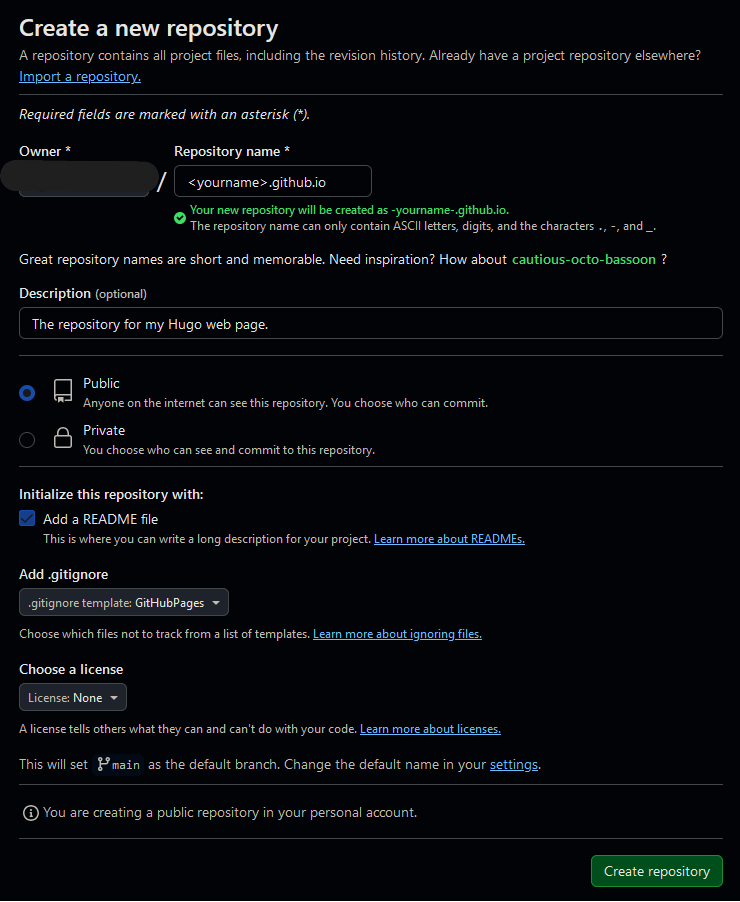
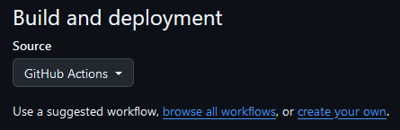

# Utilizar *GitHub Pages* para hostear tu propia web
## Introducción
Siempre he querido tener una página web sencillita donde ir posteando **fácilmente** (enfasis en esto) artículos. Hoy en día es más fácil que antaño, pero se deben tener en cuenta muchas cosas que no són evidentes como certificados SSL, dominio o hosting. Por suerte tenemos una forma de no tener que lidiar con ello a través de GitHub. Para ello utilizaremos un renderizador de páginas web estáticas, en mi caso es Hugo, pero se pueden utilizar otros sin problema. También se puede añadir el paso opcional de utilizar un dominio propio, la única parte que cuesta dinero, pero al cabo del año no es nada.

Para hacer un adelanto de lo que será, el workflow será el siguiente. Tendremos un repositorio que contendrá nuestras páginas web. En este repositorio subiremos y modificaremos los *posts* o páginas que querramos. Una vez subido a GitHub, a través	de GitHub Actions, se ejecutará un *script* para renderizar y subir nuestra página web a GitHub Pages, de manera completamente automática. Hay muchas tecnologías implicadas, pero el resultado final es algo muy cómodo (solo si eres programador😅). Para personas que nunca han programado esto debe ser complicado y poco intuitivo. 

## Repositorio de GitHub
### Creación
Primerisimo, tener una cuenta de GitHub, pero si estas aquí seguramente ya tengas una. Si no es así aprovecha para crearte una, es gratis 😉. Ahora solo debemos crear un repositorio de GitHub. Podemos hacerlo a través de nuestro IDE favorito o a través de la página web. 

A la hora de crear el repositorio es conveniente ponerle el nombre de `<tu nombre de usuario>.github.io`. De esta manera el enlace a la web será más corto, es solo un detalle no es obligatorio. Lo que es más importante es que si no tienes una cuenta premium hagas el repositorio público, sino no te dejará publicarlo en GitHub Pages. El README es opcional, si pretendes compartir o enseñar el repositorio seria conveniente tenerlo. A la hora de seleccionar la plantilla del `.gitignore` selecciona GitHubPages, será conveniente modificarlo, pero sirve de base. Licencia la que quieras.

### Workflow 
Aunque no tengamos nada publicado en GitHub podemos dejar esto listo para más adelante. Vamos a aprovechar la funcionalidad de GitHub Actions para ejecutar un *script* cada vez que publiquemos en la rama principal que se encargue de publicar los cambios. Para cambiar el funcionamiento de la publicación vamos a `Ajustes > Pages` desde nuestro repositorio. Una vez allí marcamos como fuente GitHub Actions. Si no tienes ningún workflow creado 

